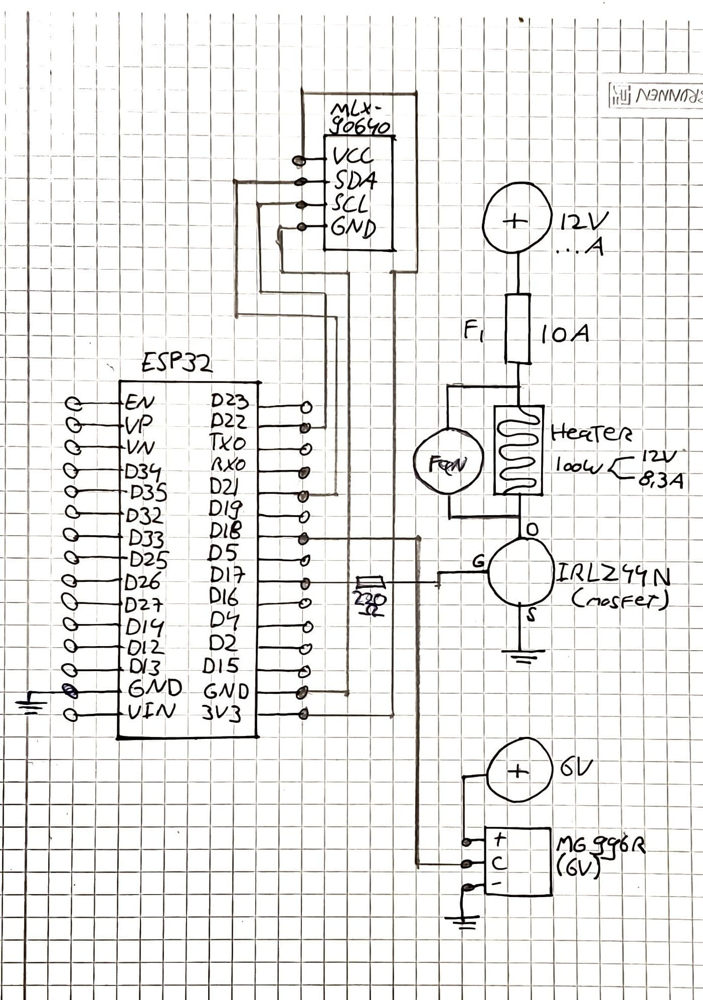

# Smart-Heater-CreaTe-
A University Project for heating rooms efficiently (and this is the code for the microcontroller used.)

I made all of the code in seperate files, but I move all of the code over into the **main.ino** file so that I can easily load it into the ESP32.

## Overview
```
Main (.ino)
│
├── CameraGrid
│   ├── reads MLX90640
│   ├── stores 32×24 frame
│   └── finds hottest grid cell
│
├── TargetMapper
│   └── converts grid position → servo angle
│
└── HeaterSystem
    ├── controls servo
    └── controls heater & fan (MOSFET)
```

## Important Images and Schematics

<br>

